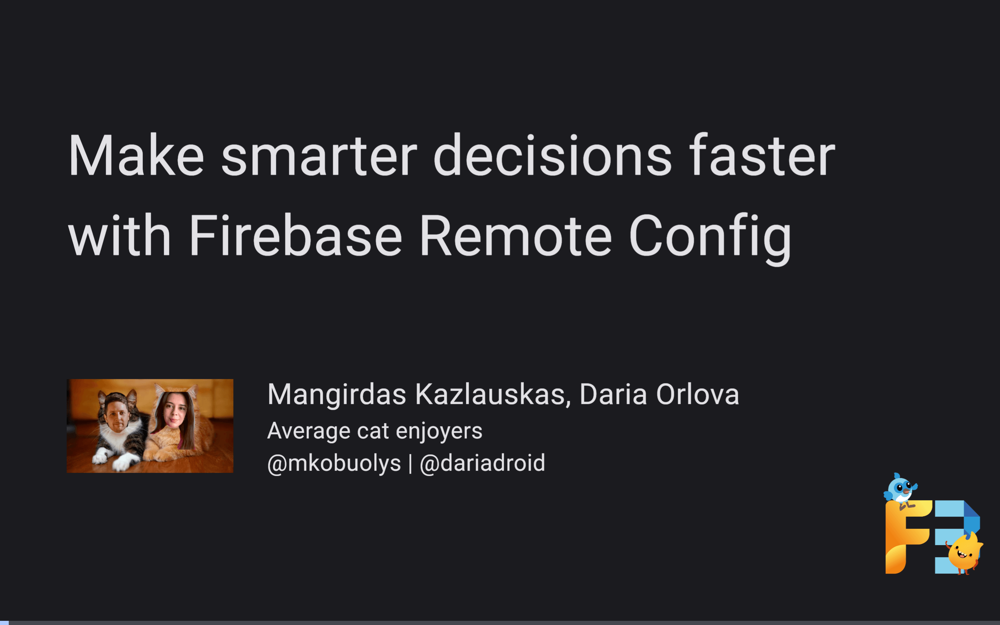

# Make smarter decisions faster with Firebase Remote Config



A presentation from [Flutter Firebase Festival](https://f3.events/) 💙💛

Powered by [flutter_deck](https://pub.dev/packages/flutter_deck) 🚀

Deployed on TBD 🎉

---

## Building

You can follow these instructions to build the slides and run them locally.

### Prerequisites

If you are new to Flutter, please first follow the [Flutter Setup](https://flutter.dev/setup/) guide.

### Building and running the slides

Slides are using a fake version of the "Purrfect match" app - Firebase configuration is not required.

For the Google Maps slide (slide #2) to work, you will need to create a Google Maps API key and add it to the `slides/web/index.html` file:

```
<script src="https://maps.googleapis.com/maps/api/js?key=GOOGLE_MAPS_API_KEY"></script>
```

You can also hide the Google Maps slide by setting the `hidden` parameter to `true` in `slides/lib/slides/intro/lithuania_and_latvia.dart` file:

```
class LithuaniaAndLatviaSlide extends FlutterDeckSlideWidget {
  const LithuaniaAndLatviaSlide()
      : super(
          configuration: const FlutterDeckSlideConfiguration(
            route: '/lithuania-and-latvia',
            steps: 6,
            hidden: true, // Add this line
          ),
        );

  // <...>
}
```

To build and run the slides, run the following commands:

```
cd slides
flutter pub get
flutter run
```

### Building and running the app

Create a new Firebase project and import the Firebase Remote Config configuration file `remote_config.json` from the `backup` directory.

Then, connect the Firebase project to the Flutter app by running the following command (replace `<project_id>` with your Firebase project ID):

```
cd app && flutterfire configure -p <project_id> -o lib/firebase/firebase_options.dart
```

Finally, run the following commands to build and install the app:

```
cd app
flutter pub get
flutter run
```
